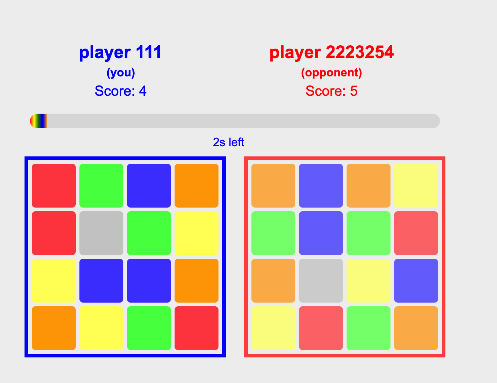
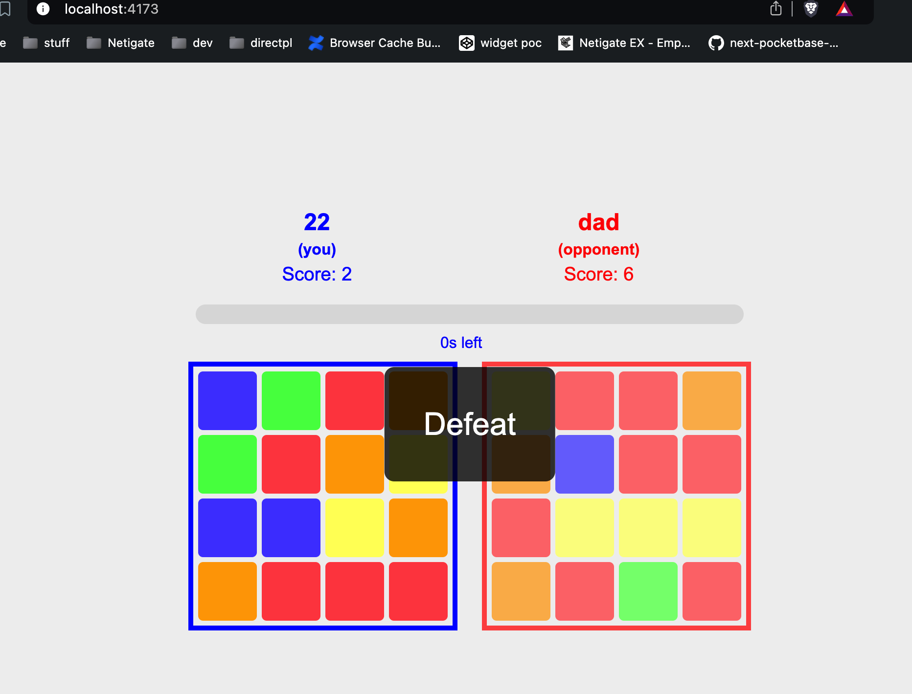

# Multiplayer Test Game - React + Socket.io, alt take

### estimated time: one evening, ~ 5h

# HOWTO:

# run `npm install && npm run dev` in both `client` and `server` directories

# OR

# run `npm install && npm run build && npm run start` in both `client` and `server` directories

# OR

# build and run the `Dockerfile`s in both `client` and `server` directories

# OR

# OR

# go to this [url](https://mp-2-client.onrender.com/)

# OR

# go to this [url](https://client-empty-sound-1014.fly.dev/)

